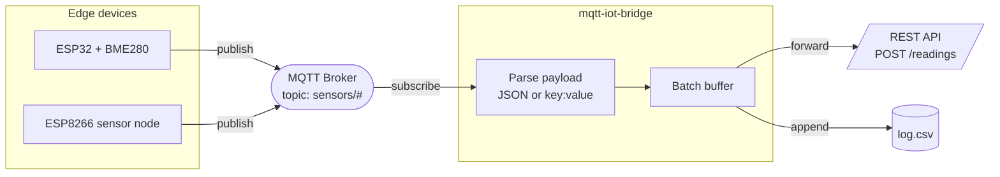

<div align="center">

# mqtt-iot-bridge

### MQTT ↔ REST bridge — subscribe to Arduino sensor topics, forward to API or log to CSV


</div>

An Arduino (ESP32/ESP8266) publishes sensor data over MQTT. This bridge subscribes, parses the payload, and either forwards batches to a REST API or writes them to a CSV log — or both.

---

## Data flow



---

## Demo

<!-- TODO: add demo GIF — record with terminalizer or OBS -->
<!--
  Recording instructions (for Kiril):
  1. Start a local broker:  mosquitto -v
  2. Flash arduino/mqtt_publisher.ino to an ESP32 (or use: mosquitto_pub -t sensors/esp32-01/data -m '{"temp":24.5,"hum":61.2}')
  3. Record the terminal while running:  python bridge.py --broker localhost --log-file readings.csv --debug
     terminalizer record mqtt-demo   →   terminalizer render mqtt-demo -o demo.gif
  4. Drop demo.gif into assets/ and replace the line below.
-->
> _Demo GIF coming soon — bridge forwarding live ESP32 BME280 readings to the REST API._

---

## Install

```bash
git clone https://github.com/kirilov07/mqtt-iot-bridge
cd mqtt-iot-bridge
pip install -r requirements.txt
```

---

## Usage

```bash
# Forward to REST API
python bridge.py \
  --broker 192.168.1.100 \
  --topic  "sensors/#" \
  --api    http://localhost:8000 \
  --token  YOUR_JWT_TOKEN

# Log to CSV only
python bridge.py \
  --broker localhost \
  --log-file readings.csv

# Both
python bridge.py \
  --broker localhost \
  --api http://localhost:8000 \
  --token YOUR_TOKEN \
  --log-file readings.csv \
  --debug
```

---

## Supported payload formats

**JSON** (recommended):
```
sensors/esp32-01/data  →  {"temp":24.5,"hum":61.2,"press":1013.1}
```

**Key:value** (plain Arduino Serial style):
```
sensors/esp32-01/data  →  temp:24.5,hum:61.2
```

Both are auto-detected — no config needed.

---

## Arduino sketch

See [`arduino/mqtt_publisher.ino`](./arduino/mqtt_publisher.ino) for a ready-to-flash ESP32 sketch that publishes BME280 readings every 5 seconds.

**Required libraries:** PubSubClient, Adafruit BME280, ArduinoJson

---

## Works with

Pairs directly with [fastapi-sensor-api](https://github.com/kirilov07/fastapi-sensor-api) as the ingestion layer between MQTT devices and the REST backend.

---

## License

MIT — see [LICENSE](LICENSE)

---

<div align="center">

Built by [Kiril Kirilov Kirilov](https://github.com/kirilov07) — Embedded Systems & AI Engineer

</div>
